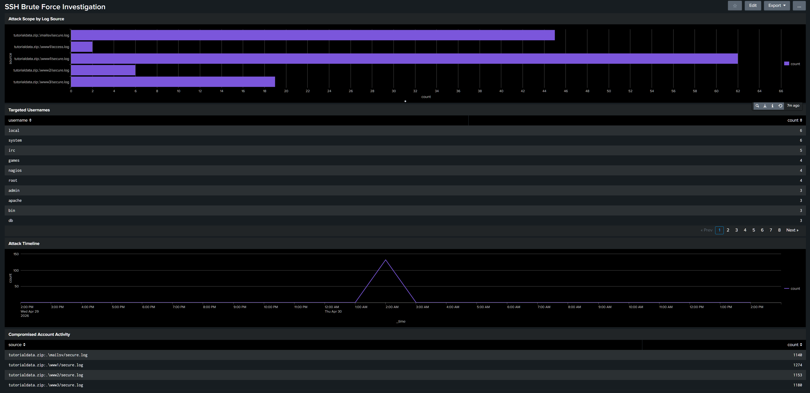
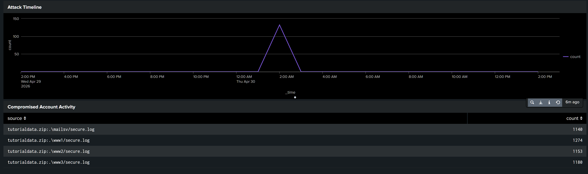
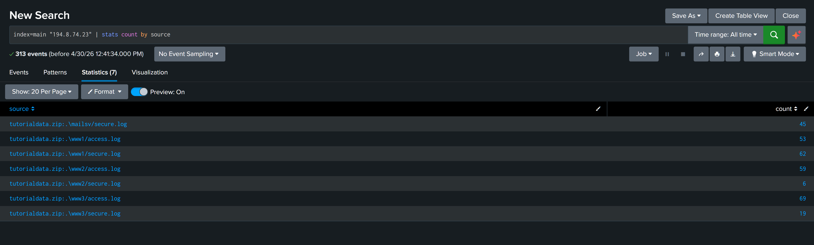
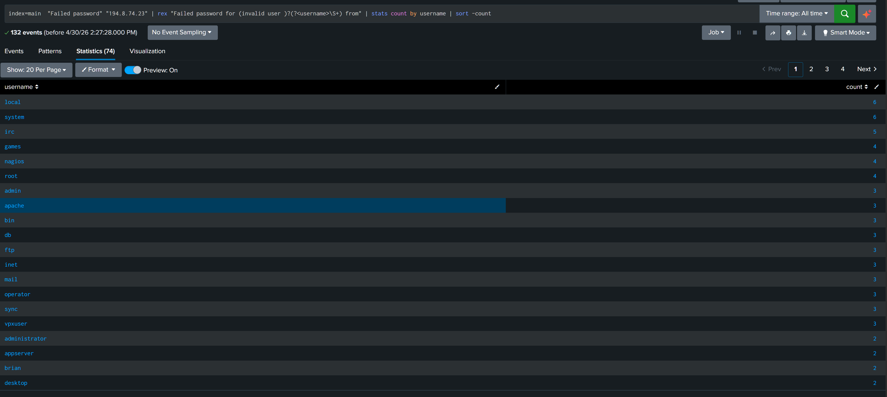
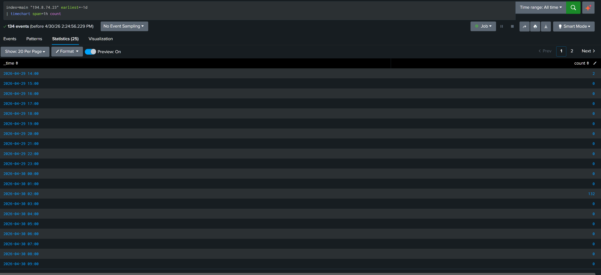
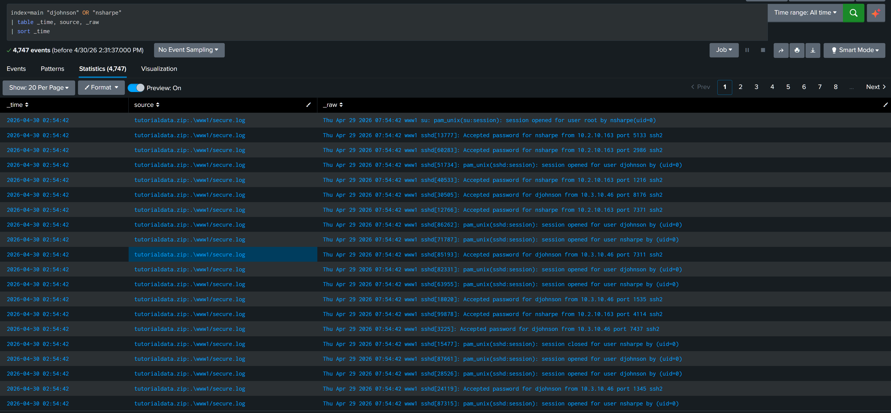

# SIEM Lab: SSH Brute Force Investigation
**Tool:** Splunk Enterprise | **Dataset:** Splunk Tutorial Data | **Analyst:** [Kiante Nolen](https://github.com/kl-nln)


---

## Overview

Built a working SIEM environment using Splunk Enterprise to ingest, query, and investigate real log data. Identified a live SSH brute force attack, traced credential compromise across two user accounts, confirmed privilege escalation to root, and documented the full investigation as a formal incident report.

**Skills demonstrated:** Log ingestion, SPL query writing, threat detection, incident investigation, escalation documentation

---

## The Incident

| Field | Detail |
|---|---|
| Attacker IP | 194.8.74.23 (external) |
| Targets | mailsv, www1, www2, www3 on SSH port 22 |
| Total Events | 313 events across 7 log sources |
| Attack Window | April 30, 2026, 02:00 AM burst (132 events in 1 hour) |
| Compromised Accounts | nsharpe, djohnson |
| Privilege Escalation | nsharpe escalated to root via su, confirmed |
| Severity | HIGH |

### Attack Chain
```
194.8.74.23 (external attacker)
    └── Reconnaissance probe at 14:00 (2 events)
    └── 12-hour silence (waiting for off-hours)
    └── Brute force burst at 02:00 AM (132 events)
         └── nsharpe compromised from 10.2.10.163
              └── su to root: PRIVILEGE ESCALATION
         └── djohnson compromised from 10.3.10.46
              └── root opens sessions on their behalf
```

---

## Dashboard




---

## SPL Queries

### Query 1: Attack Scope Across Infrastructure
```spl
index=main "194.8.74.23" | stats count by source
```
**Finding:** Single attacker IP generated 313 events across 7 log sources, confirming an infrastructure-wide attack rather than a single targeted probe.



---

### Query 2: Brute Force Username Enumeration
```spl
index=main "Failed password" "194.8.74.23"
| rex "Failed password for (invalid user )?(?<username>\S+) from"
| stats count by username
| sort -count
```
**Finding:** 20+ usernames attempted using a standard Linux system account wordlist. Top targets were local (6), system (6), irc (5), and root (4). Confirms a non-targeted opportunistic dictionary attack.



---

### Query 3: Attack Timeline
```spl
index=main "194.8.74.23" earliest=-1d | timechart span=1h count
```
**Finding:** 2 events at 14:00 as a recon probe, silence for 12 hours, then 132 events at 02:00 AM. Textbook off-hours attack timing and a deliberate strategy to evade SOC monitoring.



---

### Query 4: Compromised Account Investigation
```spl
index=main "djohnson" OR "nsharpe"
| table _time, source, _raw
| sort _time
```
**Finding:** Both accounts show Accepted password events during the 02:54 AM attack window from two separate internal IPs. nsharpe executed su to root. Root opened multiple sessions for djohnson. Confirms credential compromise and privilege escalation.



---

## Investigation Summary

### What I Found
A two-phase SSH brute force attack originating from external IP 194.8.74.23. The attacker conducted an initial recon probe during business hours, waited 12 hours, then launched a concentrated credential stuffing assault at 2 AM using a Linux system account wordlist. Two accounts were successfully compromised. nsharpe escalated to root via su. Activity originated from two separate internal IPs suggesting either lateral movement or pre-existing internal compromise.

### How I Found It
1. Ran a broad IP-based search to quantify attack scope across all log sources
2. Used regex extraction to enumerate the full username wordlist
3. Built a timechart to identify the probe-then-burst pattern and confirm off-hours timing
4. Investigated users with successful sessions during the attack window to confirm compromise and privilege escalation

### What I Would Escalate
- **Immediate:** Block 194.8.74.23 at perimeter firewall
- **Immediate:** Disable nsharpe and djohnson accounts pending forensic review
- **Immediate:** Audit www1 for persistence mechanisms including cron jobs, new SSH keys, and new accounts added by root
- **Urgent:** Investigate internal IPs 10.2.10.163 and 10.3.10.46 for signs of compromise
- **Urgent:** Full sudo/su audit across all servers for the 24-hour window

### Recommended Controls
- Enforce SSH key-based authentication only and disable password auth
- Implement fail2ban to auto-block IPs after 5 failed attempts
- Restrict SSH to known internal IPs via firewall allowlist
- Set PermitRootLogin no in sshd_config
- Configure Splunk alert for more than 5 failed SSH attempts from a single IP within 5 minutes

---

## Tools Used
- **Splunk Enterprise** (Free Trial): log ingestion, SPL queries, dashboards
- **Splunk Tutorial Dataset:** tutorialdata.zip covering mailsv and www1-3 access and secure logs
- **SPL:** Search Processing Language for threat detection queries

---

## Related Projects

- [AD IAM Auditor](https://github.com/kl-nln/ad-iam-auditor)
  Live Active Directory security auditing with automated PDF and HTML report generation
- [Wazuh EDR Homelab](https://github.com/kl-nln/wazuh-edr-homelab)
  Open source EDR deployed across a multi-OS environment with brute force simulation and MITRE ATT&CK mapping
- [Wireshark Network Traffic Analysis Lab](https://github.com/kl-nln/wireshark-lab)
  Packet analysis and network forensics lab documenting real threat traffic including NetSupport Manager RAT
- [Python Security Automation Labs](https://github.com/kl-nln/python-automation-labs)
  18 production-ready security automation tools across AWS security, network recon, and threat detection

---

*Part of an active cybersecurity homelab portfolio documenting the path to Cloud and AI Security Engineering.*
